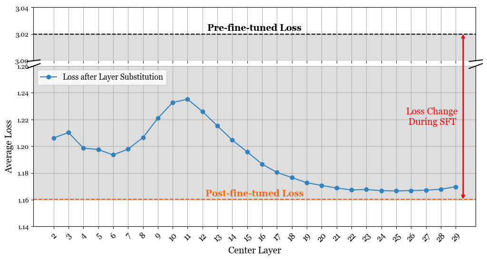

# Spectral Insights into Data-Oblivious Critical Layers


<p align='center' style="text-align:center;font-size:1.15em;">
  <a href="https://xuyuan0204.github.io/" target="_blank" style="text-decoration: none;">Xuyuan Liu<sup>1</sup></a>&nbsp;,&nbsp;
  <a href="https://hsiung.cc/" target="_blank" style="text-decoration: none;">Lei Hsiung<sup>1</sup></a>&nbsp;,&nbsp;
  <a href="https://sites.google.com/site/yangyaoqingcmu/" target="_blank" style="text-decoration: none;">Yaoqing Yang<sup>1</sup></a>&nbsp;,&nbsp;
  <a href="https://sites.google.com/umich.edu/yujunyan/home" target="_blank" style="text-decoration: none;">Yujun Yan<sup>1</sup></a>
  <br/>
  <sup>1</sup>Dartmouth College
</p>
<div align="center" style="display: flex; justify-content: center; gap: 2em;">
  <a href="https://arxiv.org/abs/2506.00382" target="_blank" style="text-decoration: none; font-weight: bold; font-size:1.15em;">📄 Paper (arXiv)</a>
  <a href="https://graphminddartmouth.github.io/Data-Oblivious-Critical-Layers/" target="_blank" style="text-decoration: none; font-weight: bold; font-size:1.15em;">💻 Project Page</a>
</div>


---
This repository contains code for **Spectral Insights into Data-Oblivious Critical Layers in Large Language Models.**
## Background

Large language models (LLMs) are remarkably good at generating and understanding text, yet we still know little about how their internal layers process information. Previous work typically identifies "important" layers only after a model has been fine-tuned on a particular dataset, making these findings inherently post-hoc and dataset-specific. But are critical layers an intrinsic property of the model, independent of specific data? If so, can we predict a model's future training behavior from its current state alone?

To investigate these questions, we adopt a different approach: we analyze off-the-shelf (pre-fine-tuned) models and show that **certain layers are intrinsically more easily adapted during subsequent fine-tuning**. We further demonstrate that each layer's **Representation Dynamics** reliably predicts its behavior in subsequent training steps, regardless of the dataset used.

## Data-oblivious Critical Layers & Representation Dynamics

### Critical Layers Identified during Supervised Fine-Tuning
We identify the critical layers during Supervised Fine-Tuning (SFT) by substituting each layer in the fine-tuned model with its corresponding layer from the pre-fine-tuned model, and then measuring the loss reduction of the model during SFT for each layer. High values here indicate that the layer is more sensitive during the fine-tuning steps.



To calculate the loss by substituting the layer centered at a given index, execute the following commands in the `./llama2` directory:

```bash
for ((i=2; i<=30; i+=1)); do
    prune_list="[$((i-2)),$((i-1)),$i,$((i+1)),$((i+2))]" 

    echo "Running prune_inference.py with prune_list=${prune_list}"

    CUDA_VISIBLE_DEVICES=0  python prune_inference.py \
    --model_name   ./ckpt/llama7b_dolly \
    --prompt_file  ./ft_datasets/dolly_dataset/dolly_test.jsonl \
    --prompt_template_style 'dolly' \
    --output_file safety_evaluation/llama7b_dolly_loss_center_res/prune_${i}.jsonl \
    --origin_model_name meta-llama/Llama-2-7b-chat-hf \
    --prune_list "${prune_list}" \
    --fsdp True 
done
```

An example output substituting around the 16th layer is provided in `./llama2/safety_evaluation/llamadolly-7b/prune_16.jsonl`.


### Representation Dynamics of the Pre-fine-tuned Models

We also observe that these CKA patterns and the **change-point layers** are independent of the data used to compute CKA, and are instead determined by the pre-fine-tuned model state.


To examine representation dynamics, run:

```bash
CUDA_VISIBLE_DEVICES=0  python run_cka.py --modelname="meta-llama/Llama-2-7b-chat-hf" --dataset="pure_bad" --type="linear" --fsdp=False
```

in the `./llama2` directory. We also provide some example visualizations of the results, available in `/llama2/model_cka/Llama-2-7b-chat-hf`.


### Correlation

To check the correlation between  $\mathcal{L}\left(\mathcal{D}_{\text {test }}, \tilde{\boldsymbol{\theta}} / L_{\text {local }}^{\ell}\right)$ with representation term $\delta^{\ell}$, please execute the `./corr_evaluation.ipynb` notebook to load the results of the CKA calculation and loss in each layer. Then, calculate the corresponding rank correlation.


## Spectral Analysis

To perform spectral analysis in the model's representation space, execute the following:

```bash
CUDA_VISIBLE_DEVICES=0  python store_activation.py --modelname="meta-llama/Llama-2-7b-chat-hf" --dataset="dolly" --fsdp=True
```

This command stores activations for sampled data on each layer. To replicate Figure 3, 


please run `eigen_analysis.ipynb` to perform CCA analysis on the principal components.

Additionally, refer to `eigen_intervene.ipynb` for implementing the principal component removal method described in Section 4.2 to examine how semantic information is stored in these components.


## Finetuning

For model finetuning, we have built upon the official Llama2 finetuning guidelines ([llama-recipes](https://github.com/facebookresearch/llama-recipes)) with adaptive changes for the Phi/Llama3 model.


```bibtex
@misc{liu2025spectralinsightsdataobliviouscritical,
  title={Spectral Insights into Data-Oblivious Critical Layers in Large Language Models}, 
  author={Xuyuan Liu and Lei Hsiung and Yaoqing Yang and Yujun Yan},
  year={2025},
  eprint={2506.00382},
  archivePrefix={arXiv},
  primaryClass={cs.LG},
  url={https://arxiv.org/abs/2506.00382}, 
}
```

